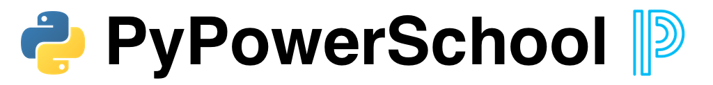

[](https://pypi.org/project/pypowerschool/)
[](https://pypi.org/project/pypowerschool/)
[](https://opensource.org/licenses/MIT)


PyPowerSchool is a basic Python wrapper for asynchronous communication with the PowerSchool API. The goal is to simplify the process of communicating with the [PowerSchool Student Information System](https://www.powerschool.com/solutions/student-information-system-sis/) API by handling authentication and decoding, allowing you to focus on using the data, not retrieving it.

_PyPowerSchool is not endorsed, sponsored, or affilitated with PowerSchool in any way._

***

## Table of Contents
* [PowerSchool Plugin](#powerschool-plugin)
* [Usage](#usage)
* [PowerQueries](#powerqueries)
* [Contributing](#contributing)
* [License](#license)

---

## PowerSchool Plugin
Before using PyPowerSchool, you will need to create and install a data access plugin on your PowerSchool server. Information about creating the plugin file can be found on the [PowerSchool Developer Support](https://support.powerschool.com/developer/#/page/plugin-xml) site. We have created an example plugin ([PSDataAccessCorePlugin](https://github.com/dougpenny/PSDataAccessCorePlugin)) that you can use as is, or modify as you see fit. Once you have installed the plugin, you will be provided a client ID and client secret that you will use for authenticating with the PowerSchool server.


## Usage
Begin by installing the PyPowerSchool module, using `pip`.

```shell
pip install pypowerschool
```

In your code, simply import the PyPowerSchool module and instantiate a new client object. The constructor requires three arguments:
1. base_url - the base URL of your PowerSchool server
2. client_id - client ID, found after installing the data access plugin
3. client_secret - client secret, found after installing the data access plugin

```python
from pypowerschool import powerschool

client = powerschool.Client('https://example.powerschool.com', 'client-id', 'client-secret')
```

Once you have a client, you can start making asynchronous calls to the API.
```python
# returns list of all schools in the current district
all_schools = await client.schools_in_district()

# returns list of all students for school with ID of 3
students = await client.students_for_school(3)

# returns dictionary of student with DCID of 1234
student = await client.student_for_dcid(1234)
```

Refer to the [`endpoints.py`](./src/pypowerschool/endpoints.py) file for other built-in methods. Additionally, you can use the [`fetch_item`](./src/pypowerschool/powerschool.py#L130) and [`fetch_items`](./src/pypowerschool/powerschool.py#L162) methods to access any PowerSchool endpoint. Basic support for `POST` has been included through the [`post_data`](./src/pypowerschool/powerschool.py#L229) method.

## PowerQueries
PowerQueries are a feature that allows for the creation of custom API endpoints. PyPowerSchool only includes core endpoints and PowerQueries provided directly by PowerSchool. To add additional core PowerQueries to PyPowerSchool, you will need to modify the plugin file ([PSDataAccessCorePlugin](https://github.com/dougpenny/PSDataAccessCorePlugin)) with the proper <[access-request](https://support.powerschool.com/developer/#/page/access-request)> elements.

Using a PowerQuery endpoint works just like any other endpoint. The `powerquery` method requires the PowerQuery endpoint URL and, optionally, a dictionary of arguements for the PowerQuery.

```python
# returns a list of grade levels for the school and district office
grade_levels = await client.powerquery('/ws/schema/query/com.pearson.core.schools.grade_levels')

# returns school information for the school with an ID of 1
school_details = await client.powerquery('/ws/schema/query/com.pearson.core.school.school_detail', {'school_number':[1]})
```

## Contributing
If you have a feature or idea you would like to see added to PyPowerSchool, please [create an issue](https://github.com/dougpenny/PyPowerSchool/issues/new) explaining your idea.

Likewise, if you come across a bug, please [create an issue](https://github.com/dougpenny/PyPowerSchool/issues/new) explaining the bug with as much detail as possible.

The PowerSchool API provides access to a lot of information and, unfortunately, we don't have time to research and implement every endpoint. Please feel free to open a pull request with any additional endpoints you create. We would love to have as many of the core endpoints covered as possible.

## License
PyPowerSchool is released under an MIT license. See [LICENSE](https://opensource.org/licenses/MIT) for more information.
